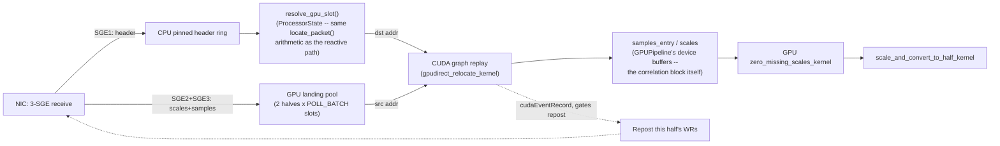
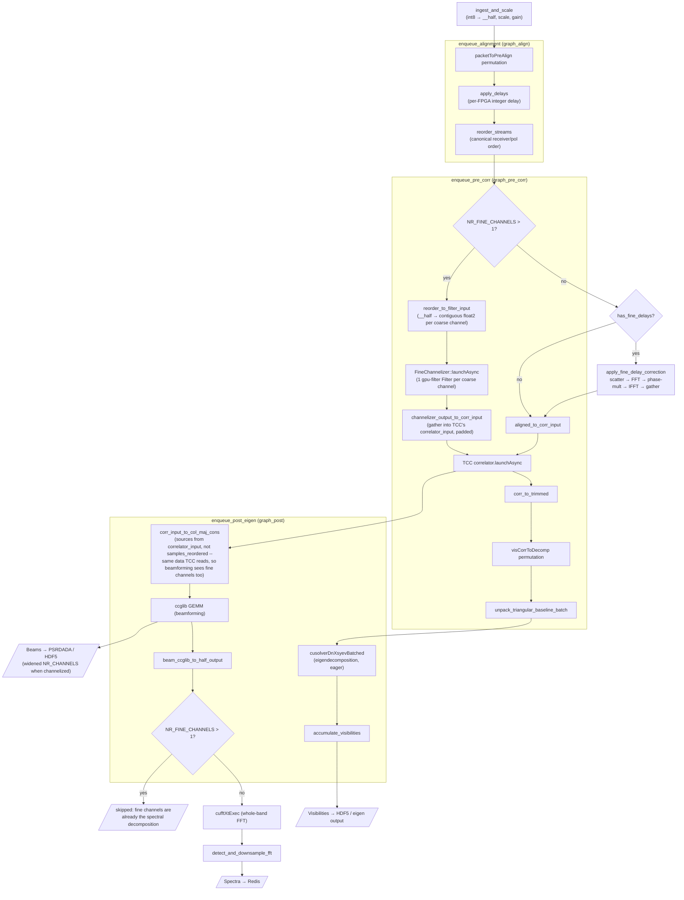
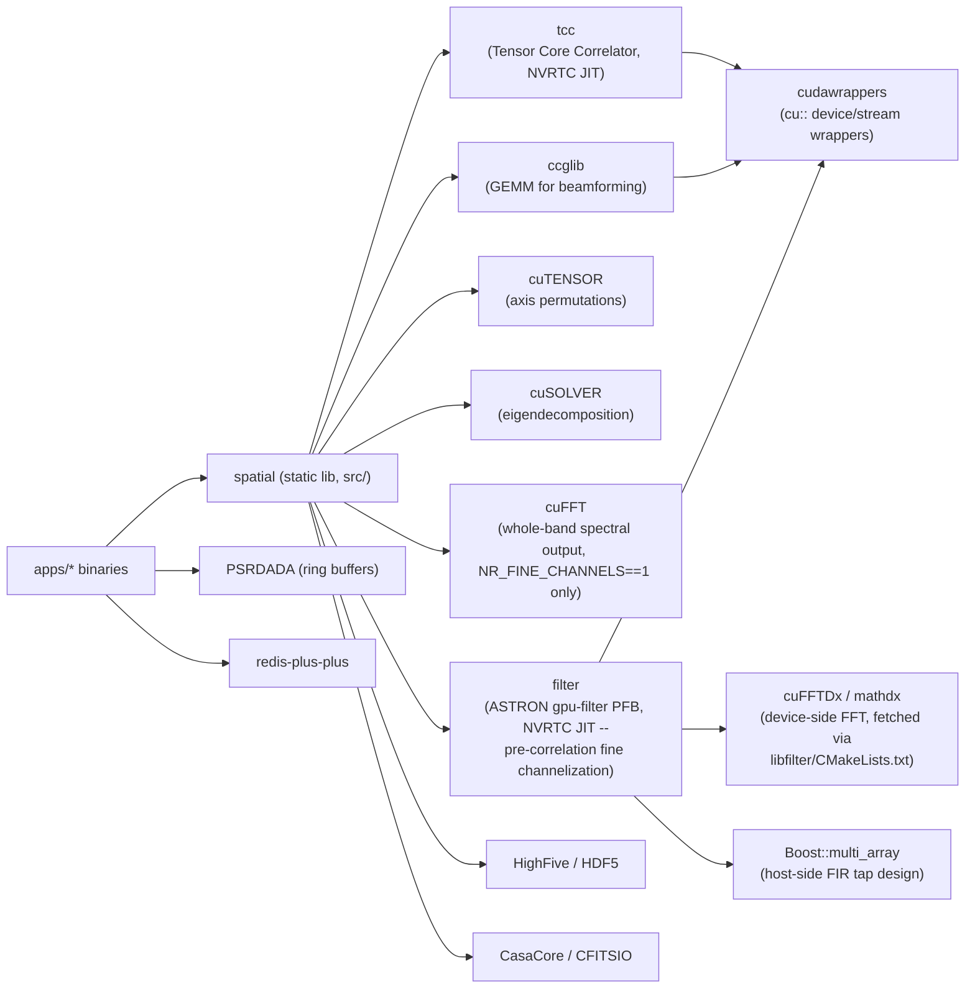
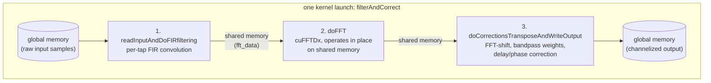

# LAMBDA pipeline architecture

Living document — update the relevant diagram in the same change that alters a pipeline's stages,
buffer shapes, or component relationships. See `CLAUDE.md`'s Documentation section for the policy.

## 1. Top-level data flow

```mermaid
flowchart LR
    subgraph capture["Packet capture (src/spatial.cpp)"]
        UDP[KernelSocketPacketCapture]
        PCAP[PCAPPacketCapture /\nPCAPMultiFPGAPacketCapture]
        IBV[libibverbs RDMA capture]
    end

    subgraph reassembly["ProcessorState&lt;T&gt; (spatial.hpp)"]
        RING[Triple-buffered ring buffer]
        MISS[Missing-packet tracking]
        ALIGN[FPGA-to-FPGA delay alignment]
    end

    subgraph gpu["GPUPipeline&lt;T&gt; (one Lambda*Pipeline variant)"]
        INGEST[int8 → __half\nscale + gain]
        CORR[Correlate (TCC)]
        BEAM[Beamform (ccglib GEMM)]
        EIG[Eigendecompose (cuSOLVER)\nRFI mitigation]
        FFT[Spectra / bandpass (cuFFT)]
    end

    subgraph output["Output writers (output.hpp, writers.hpp)"]
        HDF5[HDF5Beam/Visibilities/FFT/\nProjectionEigenWriter]
        PSRDADA[PSRDADABeamWriter]
        REDIS[RedisEigendata/BeamFFTWriter]
        FITS[CasaCore / CFITSIO writers]
    end

    UDP --> RING
    PCAP --> RING
    IBV --> RING
    RING --> MISS --> ALIGN --> INGEST
    INGEST --> CORR --> EIG
    INGEST --> BEAM
    EIG --> BEAM
    BEAM --> FFT
    CORR --> HDF5
    EIG --> HDF5
    BEAM --> PSRDADA
    BEAM --> REDIS
    FFT --> REDIS
    BEAM --> FITS
```

`release_buffer` (on `ProcessorStateBase`) is the hand-back from a `GPUPipeline` once it's done
reading a buffer, so `ProcessorState` can reuse that ring-buffer slot for new packets.

### 1a. GPUDirect RDMA ingest variant (`LibibverbsGpuDirectPacketCapture`)

An alternative to the `IBV` box above: instead of copying each packet into the CPU ring and later
`cudaMemcpyAsync`-ing a whole completed buffer to the GPU, the NIC DMAs payload straight into GPU
memory, and a CUDA-graph-replayed kernel relocates it to its final correlation-buffer position once
the header reveals where it belongs (channels from one FPGA interleave on a single QP — the FPGA
can't assign a distinct UDP port per channel — so the destination can't be predicted before a packet
arrives). See `include/spatial/libibverbs.hpp` and the design writeup this implements.



Key points the diagram doesn't show directly:
- **Double-buffer safety**: a landing-pool half's WRs are only reposted after its *previous*
  relocation graph replay is confirmed done (`cudaEventQuery`), so the NIC never overwrites data the
  relocation kernel hasn't read yet.
- **Placement arithmetic is shared, not duplicated**: `resolve_gpu_slot()` (on `ProcessorStateBase`,
  implemented by `ProcessorState<T,...>`) calls the same `locate_packet()`/`packet_index_for_buffer()`
  the reactive path uses (`spatial.hpp`) — the two paths can never numerically diverge.
  `GPUPipeline::gpu_landing_samples_ptr`/`gpu_landing_scales_ptr` (`pipeline_base.hpp`) expose the
  device buffers `resolve_gpu_slot()` resolves addresses into.
- **Validated at 32 channels/4-FPGA** against a synthetic busy-kernel proxy and the real
  `LambdaGPUPipeline` (`apps/bench_gpudirect_scatter.cu`, `apps/bench_gpu.cu --relocation-check`) —
  64-channel validation is deferred pending production-scale GPU memory.
- **Unverified against real ibverbs/GPUDirect hardware**: this environment has no libibverbs-dev
  install, so `libibverbs.hpp`'s `LibibverbsGpuDirectPacketCapture` itself has never been compiled —
  everything upstream of the NIC (placement arithmetic, the relocation kernel, `zero_missing_scales`)
  is tested against real GPU hardware in `tests/test_ibverbs_placement.cu` and
  `tests/test_gpudirect_scatter.cu`.

## 2. `LambdaConfig` — the shape contract

Every type used across ingest, GPU processing, and output is derived from one compile-time struct,
`LambdaConfig<...>` (`include/spatial/packet_formats.hpp`), parameterized by channel/receiver/beam
counts etc. Apps instantiate their own concrete `Config` from `NR_OBSERVING_*` CMake cache
variables and thread it through everything as a template parameter.

```mermaid
flowchart TD
    CFG["LambdaConfig&lt;NR_CHANNELS, NR_FPGA_SOURCES,\nNR_RECEIVERS, NR_PACKETS_FOR_CORRELATION,\nNR_BEAMS, NR_PADDED_RECEIVERS, ...&gt;"]
    CFG --> PKT["Packet types\nInputPacketSamplesType\nPacketScalesType"]
    CFG --> VIS["Visibilities\nEigenvalueOutputType\nEigenvectorOutputType"]
    CFG --> BEAMT["BeamOutputType"]
    CFG --> SPEC["FFTOutputType\nAntennaFFTOutputType"]
    PKT --> ProcessorState
    VIS --> LambdaGPUPipeline
    BEAMT --> LambdaGPUPipeline
    SPEC --> "Antenna/BeamformedSpectraPipeline"
```

## 3. `Lambda*Pipeline` variants

All variants implement the `GPUPipeline` interface (`include/spatial/pipeline_base.hpp`) and share
`LambdaPipelineIngest<T>::ingest_and_scale` (`pipeline/common.hpp`) as their first step.

All seven variants share the same pre-correlation fine-channelization wiring (`FineChannelizer<T>`,
`reorder_to_filter_input`/`channelizer_output_to_*` in `spatial.cuh` — see Section 6 and
`CLAUDE.md`'s `NR_OBSERVING_FINE_CHANNELS`/`NR_OBSERVING_FINE_CHANNEL_EDGE_TRIM` docs), gated
`if constexpr (T::NR_FINE_CHANNELS > 1)` so the `NR_FINE_CHANNELS == 1` path stays byte-for-byte
identical to the pre-channelization behaviour. For the pipelines whose only spectral-resolution
source was a whole-band FFT (`LambdaGPUPipeline`, `LambdaAntennaSpectraPipeline`,
`LambdaBeamformedSpectraPipeline`, `LambdaAdaptiveBeamformedSpectraPipeline`), that FFT is deleted
entirely once channelized — gpu-filter's fine channels provide the spectral resolution directly, so
running an FFT on top would be redundant. `LambdaCorrBeamOnlyGPUPipeline` never had that
whole-band-FFT dependency (it's benchmark-only), but its fused single-kernel packet-to-correlator/
packet-to-beamformer path had no seam for a channelizer at `NR_FINE_CHANNELS == 1`, so it's the one
variant where the two branches are genuinely different code shapes rather than the same path at a
different width.

| Pipeline | Purpose | Correlates? | Beamforms? | Eigendecomposes? | Spectral output? |
|---|---|---|---|---|---|
| `LambdaGPUPipeline` | Baseline correlate+beamform+dump visibilities | yes | yes | yes | pre-correlation fine channels (FFT deleted when channelized) |
| `LambdaAntennaSpectraPipeline` | Per-antenna spectra only | no | no | no | pre-correlation fine channels (FFT deleted when channelized) |
| `LambdaBeamformedSpectraPipeline` | Beamformed spectra, no correlation | no | yes | no | pre-correlation fine channels (FFT deleted when channelized) |
| `LambdaAdaptiveBeamformedSpectraPipeline` | RFI-mitigated beamforming via eigen-projection | yes | yes (x2: raw + projected) | yes | pre-correlation fine channels (post-beam FFT/edge-trim deleted when channelized) |
| `LambdaCorrBeamOnlyGPUPipeline` | Benchmark-only correlation+beamforming, no FFT output | yes | yes | no | pre-correlation fine channels (disabled path keeps its fused fast-path kernels unchanged) |
| `LambdaProjectionPipeline` | Accumulates projection matrices for RFI mitigation | yes | no | yes | offline only |
| `LambdaPulsarFoldPipeline` | Folds beamformed time series for pulsar timing | yes (RFI-mitigate mode only) | yes | varies | no (folding is external, via DSPSR) |

All seven support `NR_FINE_CHANNELS > 1` as of this rollout; the edge-channel trim
(`NR_FINE_CHANNEL_EDGE_TRIM`) is applied uniformly by the shared `channelizer_output_to_corr_input`/
`channelizer_output_to_col_maj_cons`/`channelizer_output_to_antenna_power` kernels, not
per-pipeline.

## 4. `LambdaGPUPipeline` stage detail

The most complete variant — correlate, beamform, RFI-mitigate via eigendecomposition, and
accumulate visibilities. Three of its stages are captured as CUDA graphs (`graph_align`,
`graph_pre_corr`, `graph_post`) when `SPATIAL_DISABLE_CUDA_GRAPH` isn't set; cuSOLVER stays eager
because it does host-side bookkeeping per call that graph replay wouldn't redo.

`NR_FINE_CHANNELS` (a `LambdaConfig` template parameter, default 1) controls pre-correlation
channelization via ASTRON's `gpu-filter` PFB (Section 6). With `NR_FINE_CHANNELS == 1` the
pipeline behaves exactly as before channelization was added: `aligned_to_corr_input` reshapes
`samples_reordered` straight into TCC's `correlator_input`, and the (now-deleted for the
channelized path) whole-band post-beamform FFT still runs. With `NR_FINE_CHANNELS > 1`, the
channelizer step replaces `aligned_to_corr_input`, correlation/beamforming/eigendecomposition all
operate on the widened `NR_CHANNELS = NR_FPGA_CHANNELS * NR_FINE_CHANNELS`, the old
`apply_fine_delay_correction` path is retired, and the whole-band FFT is skipped (the fine
channels themselves are now the spectral decomposition).



## 5. External library dependencies



## 6. How gpu-filter works: fusing FIR + FFT into one NVRTC kernel via cuFFTDx

ASTRON's `gpu-filter` (`extern`-equivalent fetched target `filter`, source at
`_deps/gpu-filter-src` once CMake configures) is a polyphase filterbank (PFB): a per-tap FIR
filter followed by an FFT, the standard two-stage channelizer used throughout radio astronomy.
What makes it fast enough for this pipeline's real-time budget is *how* those two stages are
combined — understanding that requires looking at `libfilter/kernel/FilterAndCorrect.cu`, the
single CUDA source file that does all the actual work.

### One kernel, not three

A naive PFB implementation looks like three separate passes: a FIR-filter kernel, a call into
cuFFT (a full library round-trip: enqueue, execute, synchronize), and a correction/output kernel
— each stage reading its input from global memory and writing its output back to global memory
for the next stage to re-read. PFBs are inherently *memory-bandwidth-bound*, not
compute-bound (a small number of multiply-adds per input sample), so that repeated
global-memory round-tripping between stages would dominate the runtime.

gpu-filter instead does everything in **one kernel launch**, `filterAndCorrect`
(`FilterAndCorrect.cu:418`), split into three *device functions* called back-to-back within that
one kernel body:



1. `readInputAndDoFIRfiltering` — reads raw input samples once from global memory, applies the
   per-tap FIR convolution, and writes the result into **shared memory** (`fft_data`), never
   touching global memory again for this stage.
2. `doFFT` — runs the FFT directly on that shared-memory buffer.
3. `doCorrectionsTransposeAndWriteOutput` — applies FFT-shift, bandpass weights, delay/phase
   correction, and writes the final result to global memory — the *only* other global-memory
   write in the whole kernel.

Global memory is touched exactly twice: once to read the raw samples, once to write the final
channelized output. Everything in between — the FIR-filtered samples and the FFT's
intermediate/output values — lives in shared memory and registers for the lifetime of one kernel
launch.

### Why cuFFTDx makes step 2 possible

Step 2 is only able to "just operate on the shared-memory buffer already in place" because the
FFT itself isn't a call into the cuFFT *library* (a separate compiled binary, invoked via a
runtime API, that expects its own device-memory input/output pointers and manages its own
kernel launches) — it's **cuFFTDx**, NVIDIA's header-only, template-based *device-side* FFT
library. cuFFTDx generates an FFT implementation as inlinable C++ device code, at compile time,
specialized for a fixed size/precision/direction/architecture:

```cpp
using FFT = decltype(Block() + Size<FFT_SIZE>() + Type<fft_type::c2c>() +
                      Direction<fft_direction::forward>() + Precision<float>() +
                      FFTsPerBlock<NR_TIMES_PER_ITERATION>() + SM<__CUDA_ARCH__>());
...
FFT().execute(thread_data, shared_memory);   // called from inside filterAndCorrect
```

Because `FFT` is a genuine C++ type (not a runtime handle), `FFT().execute(...)` is just another
function call *within* `filterAndCorrect` — the compiler inlines/specializes the whole FFT
computation into the same kernel body as the FIR and correction stages, operating on data that's
already sitting in shared memory rather than requiring a separate kernel launch with its own
memory transfers. This is the mechanism that makes the "one kernel touches global memory twice"
design possible at all: a library-call FFT (cuFFT) fundamentally can't be inlined this way, since
it's a separate compiled unit invoked through a runtime API boundary.

cuFFTDx also picks the optimal thread-block shape for the specialized FFT at compile time and
exposes it as a `__device__` global (`block_dim`, `FilterAndCorrect.cu:471`) — `Filter`'s
constructor reads this back via `cu::memcpyDtoH(&blockDim, filterModule.getGlobal("block_dim"),
...)` (`Filter.cc:136-140`) rather than the caller needing to hand-tune launch parameters.

### Why NVRTC (runtime compilation), not a precompiled library

`FFT_SIZE` (from `FilterArgs::nrChannels`), `NR_RECEIVERS`, `NR_TIMES_PER_ITERATION`, and the
sample formats are all only known when the pipeline constructs its `LambdaConfig` at
**build time of this repo**, but gpu-filter itself is a prebuilt/fetched dependency — it can't
know those values when *it's* compiled. Like `tcc` (the correlator), gpu-filter resolves this by
compiling `FilterAndCorrect.cu` at **runtime**, once, in `Filter`'s constructor
(`Filter.cc:25-127`, `compileModule`): the source is embedded in `libfilter.a` as a linked binary
blob, and `Filter`'s constructor calls it via NVRTC with every dimension baked in as a `-D`
preprocessor define (`-DNR_CHANNELS=32 -DNR_RECEIVERS=10 ...`), producing a `cu::Module` (PTX)
specialized exactly for this pipeline's shapes. This is the same reason `FineChannelizer<T>`
(`pipeline/common.hpp`) constructs one `Filter` instance per coarse channel up front, in the
pipeline constructor, rather than lazily: each instance's construction is a real compilation, not
a cheap object construction (though fast in practice, ~4s observed per instance in this
container).

### The sm_70+ requirement

`gpu-filter`'s own `CMakeLists.txt` hard-fails configure if `CMAKE_CUDA_ARCHITECTURES < 70`
(`libfilter/CMakeLists.txt`, `setup_mathdx`) — cuFFTDx requires Volta (sm_70) or newer for the
warp-level primitives and shared-memory features its generated FFT code relies on. In this
container that check is actually broken against the repo's own `CMAKE_CUDA_ARCHITECTURES=native`
default (a string, not a resolved number, at the point gpu-filter's check runs — see the build
section of this repo's `CLAUDE.md`); pass an explicit numeric value (e.g.
`-DCMAKE_CUDA_ARCHITECTURES=89` for an RTX 4060) at configure time to work around it.

**Resolved: a real bug in gpu-filter's raw-pointer `launchAsync` overload, worked around.** The
first `channelizer_->launchAsync(...)` call (inside `LambdaGPUPipeline`'s eager constructor
warmup run) was initially observed hanging indefinitely. Investigation went through several wrong
turns before landing on the real cause — worth recording precisely, since the wrong turns are
exactly the kind of thing that wastes time again if re-trodden:

- `Filter`'s constructor itself (NVRTC compile via `compileModule`) is fast (~4s observed) — ruled
  out as the cost center.
- gpu-filter's kernel, run standalone via its own `FilterTest` with the *exact* parameters this
  project uses (4 receivers, 32 channels, 16 samples/channel, 16 taps, fp32→fp16), completed in
  milliseconds — ruled out gpu-filter/cuFFTDx itself and `NR_FINE_CHANNELS` size as factors.
- A `pthread_cond_wait` blocked for 30+ seconds inside the driver call stack under
  `cuLaunchKernel`, and `nvidia-smi` showed several GB of GPU memory in use with "no running
  processes found" from inside the (sandboxed) shell — this was *wrongly* interpreted as an
  external tenant contending for the GPU. It was actually the user's own normal desktop GPU usage
  (Xorg, window manager, browser, chat apps), fully accounted for by `nvidia-smi`'s own process
  list when checked from the right vantage point — not a code issue, but also not evidence of
  anything abnormal. Lesson: don't infer "external contention" from a memory-accounting mismatch
  without checking whether it's explained by ordinary, visible processes first.
- The real isolation came from bypassing the whole pipeline (and even `LambdaGPUPipeline`
  entirely): a minimal repro constructing just one `ppf::Filter` and calling `launchAsync` — with
  *nothing* else, not even TCC — reproduced the identical hang. This ruled out any interaction
  with the rest of the pipeline.
- Systematically varying that minimal repro (explicit vs. implicit/primary CUDA context; raw
  `CUstream`/`CUdeviceptr` vs. `cu::Stream`/`cu::DeviceMemory` wrapper objects) isolated the
  actual variable: **`Filter`'s raw-pointer `launchAsync` overload**
  (`libfilter/Filter.cc:258-275`, which internally wraps the raw handles into temporaries and
  calls the `cu::Stream`-based overload) **hangs in `cuLaunchKernel` every time**, regardless of
  context model. Calling the `cu::Stream`-based overload directly — with the exact same
  underlying stream and device pointers, just wrapped into non-owning `cu::Stream`/
  `cu::DeviceMemory` objects by the *caller* instead of internally by `Filter` — works reliably
  and returns immediately, every time this was tried.

The exact mechanism inside gpu-filter's own wrapping call was not isolated further (a plausible
suspect: the raw-pointer overload binds temporaries to non-`const` reference parameters on the
`cu::Stream`-based overload, which is unusual and worth scrutinizing further, but wasn't
conclusively pinned down as *the* cause). `FineChannelizer::launchAsync`
(`pipeline/common.hpp`) now calls the `cu::Stream`-based overload directly as a confirmed,
reliable workaround — not a guess. Worth reporting upstream to ASTRON if this recurs.

---

*Section 4's `LambdaGPUPipeline` diagram and Section 5's dependency graph reflect the
pre-correlation fine-channelization work as landed. The other 6 `Lambda*Pipeline` variants
(Section 3) don't yet have their own channelization wiring — see the plan for what's reusable
(`FineChannelizer<T>`, the `LambdaConfig` split) vs. what each needs to re-derive.*
